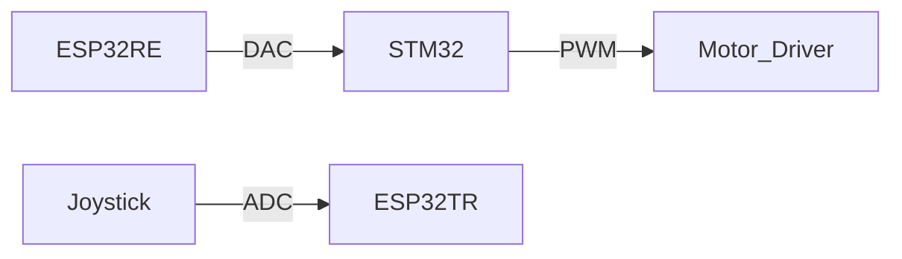

# 🛹 Differential wheeled robot Wireless Control via ESP-NOW
  
*Wireless control of Differential wheeled robot using ESP-NOW with modified STM32 firmware*

---

## 📌 Project Overview
This project combines:
1. **ESP-NOW** - Wireless communication between ESP32 controllers
2. **STM32 Firmware Hack** - Modified hoverboard motherboard firmware for custom motor control

---

## 🔧 Firmware Hierarchy
| Component          | Role                          | Source |
|--------------------|-------------------------------|--------|
| **ESP-NOW Layer**  | Handles wireless communication | [ESP-IDF](https://github.com/espressif/esp-idf) |
| **STM32 Hack**     | Motor control logic           | [Hoverboard-Firmware-Hack](https://github.com/EmanuelFeru/hoverboard-firmware-hack) |

---

## 🚀 Key Features
- **Wireless Control** (ESP-NOW)
  - Latency: <10ms
  - Range: Up to 200m (line-of-sight)
- **STM32 Modifications**
  - Custom speed/acceleration profiles
  - Deadband filtering
  - Safety cutoffs
  - Joystick calibration support

---

## ⚙️ Firmware Setup
### 1. STM32 Hoverboard Firmware
**Source**: [hoverboard-firmware-hack-FOC](https://github.com/hoverboard-robotics/hoverboard-firmware-hack-FOC/tree/master)  
**Modified Files**:
```
firmware_mods/
├── main.c               # Motor control speed
├── config.h             # Critical parameters:
└── platformio.ini              
```

**Flashing Steps**:
1. Connect ST-Link V2 to hoverboard mainboard
2. Use STM32CubeProgrammer:

*Full guide: [Original Instructions](https://github.com/hoverboard-robotics/hoverboard-firmware-hack-FOC/tree/master)*

---


## 🎮 Joystick Calibration
### Calibration Procedure
  - press the power button for more than 5 sec and release after the beep sound
  - move the potentiometers freely to the min and max limits repeatedly
  - release potentiometers to the resting postion
  - press the power button to confirm or wait for the 20 sec timeout
  - The Values will be saved to flash. Values are persistent if you flash with platformio. To erase them, make a full chip erase.


---

## 🛠️ Hardware Setup
| Component               | Quantity | Notes |
|-------------------------|----------|-------|
| Hoverboard Motherboard  | 1        | STM32F103 based |
| ESP32                   | 2        | DAC PINS |
| Analog Joystick         | 1        | 10KΩ potentiometer |
| ST-Link Programmer      | 1        | For STM32 flashing |
| 36V Battery             | 1        | Hoverboard main power |

**Wiring**:


---

## ⚠️ Critical Notes
1. **Pairing Issues**:
   - ESP-NOW requires **resetting both devices** if communication drops
2. Changing speed parameters :
 - modify esp32 code 
```
//robotReceiver.ino
#define acc 20
#define accDelay 100
#define maxspeed 80 // max value frome the center (between 0 and 126)
#define deadband 10
```
 - modify stm firmware main.c code 
```
//main.c line 281
  // ####### LOW-PASS FILTER #######
      rateLimiter16(input1[inIdx].cmd , RATE, &steerRateFixdt);
      rateLimiter16(input2[inIdx].cmd , RATE, &speedRateFixdt);
      filtLowPass32(steerRateFixdt >> 4, FILTER, &steerFixdt);
      filtLowPass32(speedRateFixdt >> 4, FILTER, &speedFixdt);
      steer = (int16_t)(steerFixdt >> 16);  // convert fixed-point to integer
      speed = (int16_t)(speedFixdt >> 16);  // convert fixed-point to integer
      steer *= 0.1;  // use only 10% of  steering speed
      speed *= 0.1;  //  use only 10% of   speed
```


---

## 📜 License & Attribution
- **STM32 Firmware**: [hoverboard-firmware-hack-FOC](https://github.com/hoverboard-robotics/hoverboard-firmware-hack-FOC/tree/master) (GPLv3)
- **ESP-NOW Code**: [Espressif ESP-IDF](https://github.com/espressif/esp-idf) (Apache 2.0)
- **Modifications**: [achref-ak](https://github.com/your-repo/hoverboard-wireless)

---


